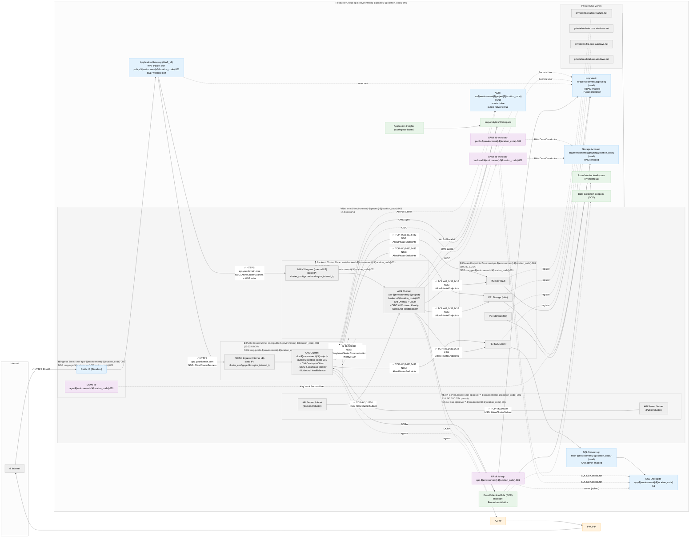
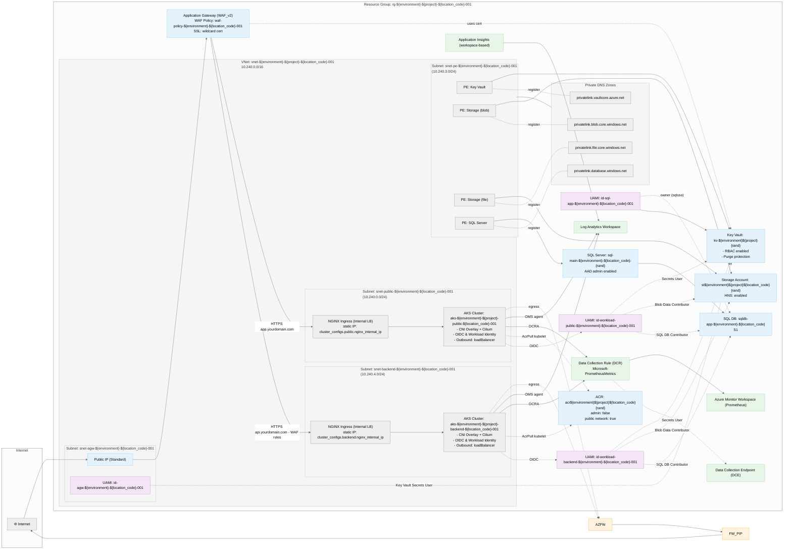

## AKS Secure Baseline – Architecture Diagram

This diagram visualizes the infrastructure defined in `infra/*.tf`: dual AKS clusters (public/backend) behind Application Gateway (WAF), private endpoints to data services, Azure Firewall egress, workload identities, monitoring, and **secure NSG configuration with inter-cluster isolation**.



## NSG Security Architecture

### Security Zones and Traffic Control

The infrastructure implements **zero-trust network segmentation** with the following security zones:

#### 🔒 **Zone Isolation Matrix**

| Source Zone | Target Zone | Access | NSG Rule | Priority |
|-------------|-------------|--------|----------|----------|
| Internet | Ingress (AGW) | ✅ HTTP/S 80,443 | AllowHttpsInbound | 1000 |
| Ingress (AGW) | Public Cluster | ✅ HTTP/S 80,443 | AllowClusterSubnets | 1000 |
| Ingress (AGW) | Backend Cluster | ✅ HTTP/S 80,443 | AllowClusterSubnets | 1000 |
| **Public Cluster** | **Backend Cluster** | ❌ **BLOCKED** | **DenyInterClusterCommunication** | **500** |
| **Backend Cluster** | **Public Cluster** | ❌ **BLOCKED** | **DenyInterClusterCommunication** | **500** |
| Any Cluster | Private Endpoints | ✅ TCP 443,1433,5432 | AllowPrivateEndpoints | 1000 |
| API Server | Cluster Nodes | ✅ TCP 443,10250 | AllowClusterSubnet | 1000 |
| External | Private Endpoints | ❌ **BLOCKED** | DenyAllInbound | 4000 |

#### 🛡️ **NSG Rules Summary**

##### **Cluster Subnet NSGs** (2 NSGs: public + backend)
```
INBOUND:
├── 1000: Allow Application Gateway → Cluster (TCP 80,443)
├── 1100: Allow Azure Load Balancer → Cluster (Any)
├── 1200: Allow API Server → Cluster (TCP 443,10250)
└── 4096: DENY ALL (Azure default)

OUTBOUND:
├── 500:  🚫 DENY Inter-Cluster Communication [CRITICAL ISOLATION]
├── 1000: Allow → Private Endpoints (TCP 443,1433,5432)
├── 1100: Allow → Azure Service Tags (TCP 443)
├── 1200: Allow → Hub VNet (Any) [if peering enabled]
└── 4000: DENY ALL [if enable_strict_nsg_outbound_deny=true]
```

##### **Application Gateway Subnet NSG**
```
INBOUND:
├── 1000: Allow Internet → AppGW (TCP 80,443)
├── 1100: Allow GatewayManager → AppGW (TCP 65200-65535)
├── 1200: Allow AzureLoadBalancer → AppGW (Any)
└── 4096: DENY ALL (Azure default)

OUTBOUND:
├── 1000: Allow → Cluster Subnets (TCP 80,443)
├── 1100: Allow → Private Endpoints (TCP 443)
├── 1200: Allow → Azure Services (TCP 443) [cert management]
├── 1300: Allow → Hub VNet (Any) [if peering enabled]
└── 4000: DENY ALL [if enable_strict_nsg_outbound_deny=true]
```

##### **Private Endpoints Subnet NSG**
```
INBOUND:
├── 1000: Allow VNet Subnets → PE (TCP 443,1433,5432,3306)
└── 4000: 🚫 DENY ALL [ALWAYS STRICT]

OUTBOUND:
├── 1000: Allow → Azure Service Tags (TCP 443,1433,5432)
├── 1100: Allow → Hub VNet (Any) [if peering enabled]
└── 4000: DENY ALL [if enable_strict_nsg_outbound_deny=true]
```

##### **API Server Subnet NSGs** (2 NSGs: one per cluster)
```
INBOUND:
├── 1000: Allow AzureCloud → API Server (TCP 443)
└── 4096: DENY ALL (Azure default)

OUTBOUND:
├── 1000: Allow → Corresponding Cluster (TCP 443,10250)
├── 1100: Allow → Azure Services (TCP 443)
├── 1200: Allow → Hub VNet (Any) [if peering enabled]
└── 4000: DENY ALL [if enable_strict_nsg_outbound_deny=true]
```

### Configuration Modes

#### **Development Mode** (`enable_strict_nsg_outbound_deny = false`)
- ✅ Core security boundaries enforced (inter-cluster isolation)
- ✅ Azure default outbound rules allow necessary services
- ✅ No explicit deny-all rule
- 🎯 **Use case**: Development, testing, initial deployment

#### **Production Mode** (`enable_strict_nsg_outbound_deny = true`)
- ✅ All development mode protections
- ✅ **Explicit deny-all outbound rule** (Priority 4000)
- ✅ Hub/firewall routing required for internet access
- 🎯 **Use case**: Production with hub-spoke + Azure Firewall

#### **Hub Integration** (`enable_vnet_peering = true`)
- ✅ Additional outbound rules to hub VNet
- ✅ Supports Azure Firewall egress routing
- ✅ Centralized network security management

### Security Benefits

- 🛡️ **Inter-Cluster Isolation**: Public and backend clusters cannot communicate directly
- 🔒 **Private Endpoint Protection**: Only authorized subnets can access data services
- 🚫 **Default Deny**: Optional strict mode blocks all unauthorized outbound traffic
- 📍 **Service Tag Precision**: Uses specific Azure service tags instead of broad internet access
- 🎯 **Configurable Security**: Can start permissive and tighten gradually
- 🔄 **Hub-Spoke Ready**: Supports centralized security through Azure Firewall



### What’s shown
- Per Terraform: VNet and subnets for App Gateway, AKS clusters (public/backend), Azure Firewall, and Private Endpoints
- Ingress path: Internet → App Gateway (WAF) → NGINX Ingress (internal IP) → AKS pods
- Egress path: AKS nodes → Azure Firewall → Internet (policy-based; UDR association optional)
- Private endpoints for Key Vault, Storage (blob/file), and SQL Server, with Private DNS zones linked to the VNet
- Workload identities per cluster and RBAC to KV/Storage/SQL; App Gateway’s UAMI to Key Vault for TLS secrets
- Optional ACR with AcrPull to cluster kubelets
- Monitoring with Log Analytics, workspace-based Application Insights, Prometheus (AMW + DCR/DCE) associated to both clusters

### Previewing the diagram
- In VS Code, install a Mermaid preview extension (e.g., “Markdown Preview Mermaid Support”), then open this file and preview.
- Or generate an image via Mermaid CLI (optional).

### Also useful (auto-generated graph)
If you want a generic dependency graph straight from Terraform, you can run (optional):
- terraform graph | dot -Tsvg > tf-graph.svg
This renders Terraform’s resource graph (less domain-specific than the curated diagram above).
