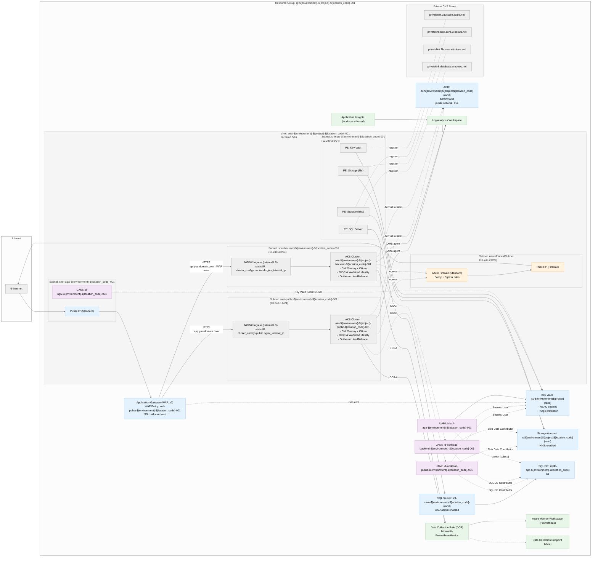

## AKS Secure Baseline – Architecture Diagram

This diagram visualizes the infrastructure defined in `infra/*.tf`: dual AKS clusters (public/backend) behind Application Gateway (WAF), private endpoints to data services, Azure Firewall egress, workload identities, and monitoring.

### What’s shown
- Per Terraform: VNet and subnets for App Gateway, AKS clusters (public/backend), Azure Firewall, and Private Endpoints
- Ingress path: Internet → App Gateway (WAF) → NGINX Ingress (internal IP) → AKS pods
- Egress path: AKS nodes → Azure Firewall → Internet (policy-based; UDR association optional)
- Private endpoints for Key Vault, Storage (blob/file), and SQL Server, with Private DNS zones linked to the VNet
- Workload identities per cluster and RBAC to KV/Storage/SQL; App Gateway’s UAMI to Key Vault for TLS secrets
- Optional ACR with AcrPull to cluster kubelets
- Monitoring with Log Analytics, workspace-based Application Insights, Prometheus (AMW + DCR/DCE) associated to both clusters

### Previewing the diagram
- In VS Code, install a Mermaid preview extension (e.g., “Markdown Preview Mermaid Support”), then open this file and preview.
- Or generate an image via Mermaid CLI (optional).

### Also useful (auto-generated graph)
If you want a generic dependency graph straight from Terraform, you can run (optional):
- terraform graph | dot -Tsvg > tf-graph.svg
This renders Terraform’s resource graph (less domain-specific than the curated diagram above).
