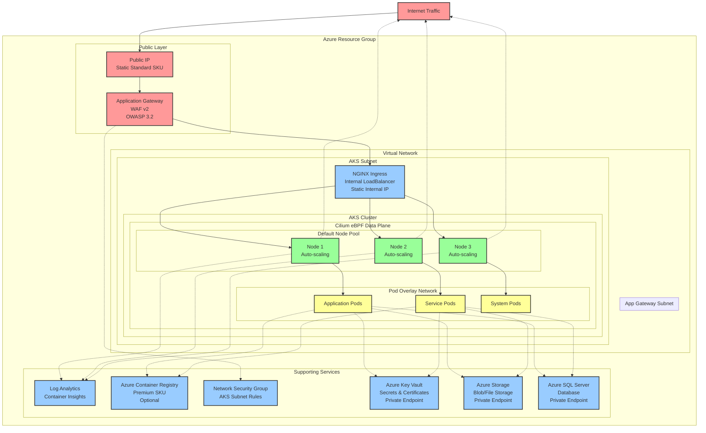

# AKS Cluster Infrastructure Specification

## Overview

Production-ready Azure Kubernetes Service (AKS) cluster deployment specification with Azure CNI Overlay, Cilium networking, Applic4. **Subnets** (dynamically calculated)
   - AKS Subnet: For cluster nodes
   - Application Gateway Subnet: For Application Gateway deployment
    - (Removed) Azure Firewall Subnet: Previously reserved for Azure Firewall (now removed)
   - Private Endpoints Subnet: For Azure Key Vault, Storage, and SQL Server private endpoints

5. **Network Security Group** Gateway with WAF, and NGINX Ingress Controller. All resource names follow Microsoft Cloud Adoption Framework (CAF) naming conventions with dynamic network address calculation.

## High-Level Architecture

### How to implement the plan
After each step, ensure that the infrastructure is functioning as expected before proceeding to the next step.
That's what you need to get the subscriptions id:
export ARM_SUBSCRIPTION_ID=$(az account show --query id -o tsv)
- [ ] Create the .tf files based on the specification, group them in layers: base (ACR, Key Vault), network, security, firewall, aks, database, storage
- [ ] Create the base parameters required for the deployment
- [ ] Create the terraform resources, based on the specification in the plan in the .tf files
- [ ] Configure the AKS to have all the required addons

### Architecture Flow
- **Internet Traffic**: Public internet traffic enters through the single public IP
- **WAF Protection**: Application Gateway provides Layer 7 load balancing with Web Application Firewall
- **Internal Routing**: Traffic is routed internally to NGINX Ingress Controller (no direct internet access to AKS)
- **eBPF Networking**: Cilium provides high-performance networking with identity-based security policies
- **Pod Distribution**: Application pods run across auto-scaling nodes with overlay networking
- **Egress**: Outbound traffic defaults to Azure load balancer SNAT (optional Azure Firewall path available)
- **Private Services**: Key Vault, Storage, and SQL Server accessible only via private endpoints
- **Zero Trust**: Only Application Gateway has public IP access; data services use private endpoints

## Architecture Requirements

### Network Architecture
**Internet → Application Gateway (Public IP + WAF) → NGINX Ingress (Internal LB) → Cilium eBPF → Pods**
**Pods → Standard Load Balancer (SNAT) → Internet**

### Core Design Principles
- Single public entry point (Application Gateway only)
- Zero direct internet access to AKS cluster
- Dynamic network address calculation (no hard-coded IPs)
- CAF compliant naming conventions
- eBPF-based networking with Cilium
- Azure CNI Overlay mode for IP efficiency
- **Single Terraform Configuration**: All infrastructure defined in one cohesive Terraform configuration without modules - modules should only be used when components need to be repeated across multiple deployments

## Configuration Requirements

### Core Parameters
- **Project Name**: Project/workload identifier for resource naming
- **Environment**: Environment designation (dev/test/prod)
- **Location**: Azure region for resource deployment
- **Location Code**: Short location identifier for naming
- **Kubernetes Version**: Target Kubernetes version
- **Node Count**: Initial cluster node count
- **Node VM Size**: Virtual machine SKU for nodes

### Network Configuration
- **VNet Address Space**: Base virtual network CIDR block
- **Subnet Calculation**: Dynamic subnet segmentation parameters
- **Service CIDR**: Kubernetes service network addressing
- **Pod CIDR**: Pod overlay network addressing

### Feature Requirements
- **Auto-scaling**: Cluster autoscaler capability
- **Application Gateway**: Layer 7 load balancer with WAF
- **NGINX Ingress**: Internal ingress controller
- **WAF Protection**: Web Application Firewall on gateway
- **Egress**: Direct SNAT via Azure load balancer (default). Optional Azure Firewall enforcement if enabled.
- **Azure Key Vault**: Secure secrets and certificate management with private endpoint access
- **Azure Storage**: Blob and file storage with private endpoint access
- **Azure SQL Server**: Managed database service with private endpoint access
- **Azure RBAC**: Role-based access control integration
- **Azure Policy**: Governance and compliance policies
- **Log Analytics**: Centralized logging and monitoring

### Egress Strategy
- **Outbound Path**: AKS nodes egress directly via Azure load balancer SNAT
- **Filtering**: Apply Cilium network policies; add NAT Gateway/Firewall later if requirements grow
- **Simplification**: Eliminates dedicated firewall management and UDR complexity

### Private Azure Services Integration
- **Private Endpoints**: All Azure services (Key Vault, Storage, SQL) accessible only via private endpoints
- **No Public Access**: Public network access disabled for all data services
- **Private DNS Zones**: Automatic DNS resolution for private endpoints
- **Workload Identity**: Pod-level identity for secure access to Azure services
- **CSI Drivers**: Kubernetes CSI drivers for Key Vault secrets and Storage volumes

### Scaling Requirements
- **Node Scaling**: Minimum and maximum node counts for autoscaling
- **Gateway Capacity**: Application Gateway scaling capacity

### Network Address Calculation
- **AKS Subnet**: Dynamically calculated subnet for cluster nodes
- **Application Gateway Subnet**: Dedicated subnet for gateway deployment  
- **DNS Service IP**: Calculated IP within service CIDR range
- **NGINX Internal IP**: Static internal IP within AKS subnet

## Resource Requirements

### Naming Convention
- **Provider**: Microsoft Cloud Adoption Framework (CAF) compliant
- **Pattern**: `{resource-type}-{environment}-{project}-{location}-{random}`
- **Random Suffix**: 3-character random string for uniqueness
- **Special Cases**: Container Registry (no hyphens), Public IP (location-specific)

### Core Infrastructure
1. **Resource Group**
   - Contains all AKS-related resources
   - Location as specified in parameters

2. **Virtual Network**
   - Address space from `vnet_address_space` parameter
   - Contains dynamically calculated subnets

3. **Subnets** (dynamically calculated)
   - AKS Subnet: For cluster nodes
   - Application Gateway Subnet: For Application Gateway deployment

4. **Network Security Group**
   - Associated with AKS subnet
   - Security rules for cluster access

### AKS Cluster Specifications
5. **Kubernetes Cluster**
   - **Network Plugin**: Azure CNI with overlay mode
   - **Network Policy**: Cilium
   - **eBPF Data Plane**: Cilium
   - **Identity**: System-assigned managed identity
   - **RBAC**: Azure RBAC enabled

6. **Default Node Pool**
   - Auto-scaling capability
   - Availability zones support
   - Subnet assignment to AKS subnet

### Application Gateway Specifications
7. **Public IP**
   - Standard SKU with zone redundancy
   - Static allocation
   - Only public IP in entire infrastructure

8. **Application Gateway**
   - **SKU**: WAF_v2 (Web Application Firewall v2)
   - **WAF Mode**: Prevention
   - **OWASP Rules**: Version 3.2
   - **Backend Target**: NGINX Ingress Controller internal IP
   - **Health Probes**: Monitor NGINX ingress health

### NGINX Ingress Controller Specifications
9. **Deployment Method**: Helm chart
   - **Service Type**: LoadBalancer with internal annotation
   - **IP Assignment**: Dynamically calculated static internal IP
   - **Subnet**: AKS subnet
   - **Public Access**: None (internal only)

### Optional Firewall & UDR
10-12. Azure Firewall, Firewall Policy, Route Table: Created only when `enable_firewall = true`; route table + associations only when `route_egress_through_firewall = true`.

### Monitoring and Security
13. **Log Analytics Workspace**
    - Container insights enabled
    - AKS cluster logs integration
    - Platform egress only (or centralized firewall if enabled)

14. **Diagnostic Settings**
    - Cluster audit logs
    - Control plane logs
    - Performance metrics
    - Firewall diagnostics only when firewall enabled

### Optional Components
15. **Azure Container Registry** (if enabled)
    - Premium SKU
    - Geo-replication capability
    - Managed identity access only

### Azure Key Vault Specifications
16. **Azure Key Vault**
    - **SKU**: Standard or Premium (for HSM-protected keys)
    - **Access**: Private endpoint only (no public access)
    - **RBAC**: Azure RBAC enabled for fine-grained access control
    - **Secrets**: Application secrets, connection strings, certificates
    - **Integration**: Pod identity for secure access from AKS

### Azure Storage Specifications
17. **Azure Storage Account**
    - **SKU**: Standard_LRS or Premium_LRS
    - **Services**: Blob storage, File shares, Queue storage
    - **Access**: Private endpoint only (no public access)
    - **Encryption**: Customer-managed keys (optional)
    - **Integration**: CSI driver for persistent volumes

### Azure SQL Server Specifications
18. **Azure SQL Server**
    - **Edition**: Standard, Premium, or Business Critical
    - **Access**: Private endpoint only (no public access)
    - **Authentication**: Azure AD authentication enabled
    - **Encryption**: Transparent Data Encryption (TDE) enabled
    - **Backup**: Automated backup with point-in-time restore

19. **Private Endpoints**
    - **Key Vault Private Endpoint**: Secure access to secrets and certificates
    - **Storage Private Endpoint**: Secure access to blob and file storage
    - **SQL Private Endpoint**: Secure database connectivity
    - **DNS Integration**: Private DNS zones for name resolution

## Managed Identities Created

### AKS System-Assigned Managed Identity
- **Purpose**: Cluster operations and Azure resource access
- **Scope**: Node management, networking, monitoring
- **Auto-created**: AKS service

### ACR Integration Identity
- **Purpose**: Container image access (if ACR enabled)
- **Scope**: Pull images from Azure Container Registry
- **Assignment**: AcrPull role on ACR resource

### Workload Identity (User-Assigned Managed Identity)
- **Purpose**: Application-level access to Azure services
- **Scope**: Key Vault secrets, Storage access, SQL Server authentication
- **Assignment**: Key Vault Secrets User, Storage Blob Data Contributor, SQL DB Contributor roles
- **Integration**: Kubernetes service account federation

## Network Configuration

### Address Space
- **VNet Address Space**: User-defined CIDR block
- **Subnet Calculation**: Dynamic using infrastructure functions
  - AKS Subnet: Calculate first subnet for cluster nodes
  - Application Gateway Subnet: Calculate dedicated subnet for gateway
- **NGINX Internal IP**: Calculated host IP within AKS subnet

### CNI Configuration
- **Network Plugin**: Azure CNI Overlay
- **Pod CIDR**: Overlay network (doesn't consume VNet IPs)
- **Service CIDR**: Internal cluster services
- **Overlay Mode**: Pods receive overlay IPs, reducing VNet IP consumption

### Cilium Networking
- **Network Policy Engine**: Cilium
- **Data Plane**: eBPF (enhanced Berkeley Packet Filter)
- **Security Policies**: Layer 3/4 and Layer 7 network policies
- **Observability**: Built-in network flow monitoring

## Security Architecture

### Zero Trust Network Model
1. **Public Entry Point**: Application Gateway (only public IP)
2. **WAF Protection**: OWASP Core Rule Set v3.2 in Prevention mode
3. **Internal Routing**: Application Gateway → NGINX Ingress (internal)
4. **Cluster Security**: Cilium eBPF policies for pod-to-pod communication
5. **Network Segmentation**: NSG rules and subnet isolation

### Traffic Flow
**Internet → Application Gateway (Public IP + WAF) → NGINX Ingress (Internal IP) → Kubernetes Services → Pods**
**Pods → Standard Load Balancer (SNAT) → Internet**

### Security Controls
- **Application Gateway**: WAF filtering, SSL termination, DDoS protection
- **NGINX Ingress**: Internal load balancing, request routing, SSL handling
- **Cilium**: Micro-segmentation, identity-based policies, API-aware filtering
- **Azure RBAC**: Role-based access control for cluster management
- **NSG Rules**: Subnet-level network access control
- **Private Endpoints**: Secure, private connectivity to Azure services
- **Workload Identity**: Pod-level identity for Azure service authentication
- **Key Vault Integration**: Secure secret and certificate management
- **Private Endpoints**: Secure, private connectivity to Azure services
- **Workload Identity**: Pod-level identity for Azure service authentication
- **Key Vault Integration**: Secure secret and certificate management

## Deployment Methodology

### Infrastructure as Code Approach
- **Single Terraform Configuration**: All infrastructure components defined in one comprehensive Terraform configuration file
- **No Terraform Modules**: Modules are reserved for components that need to be repeated; this single-instance infrastructure does not require modularization
- **Cohesive Resource Management**: All resource dependencies and relationships managed within a single configuration for clarity and simplicity
- **Direct Resource Definitions**: Each Azure resource explicitly defined without abstraction layers

### Azure Developer CLI Integration
- **azd template structure** with Infrastructure as Code provider
- **Environment-specific configuration** through parameters
- **Resource provisioning** followed by application deployment
- **Post-deployment configuration** for NGINX Ingress Controller

### Infrastructure Provisioning Order
1. Core infrastructure (VNet, subnets, NSG)
2. Azure Key Vault, Storage Account, and SQL Server with private endpoints
3. Private DNS zones for private endpoint resolution
4. AKS cluster with Cilium networking and workload identity
5. Application Gateway with WAF configuration
6. NGINX Ingress Controller with internal IP
7. Monitoring and logging configuration

### Validation Requirements
- **Connectivity Testing**: Application Gateway → NGINX → Services
- **Security Validation**: WAF rules, network policies, RBAC
- **Performance Baseline**: Load testing through complete traffic path
- **Monitoring Setup**: Verify logs, metrics, and alerting

## RBAC Configuration

### Azure RBAC Roles

#### AKS Cluster System-Assigned Identity
**Required Roles:**
- Network Contributor (on VNet/Subnets)
- Managed Identity Operator (on node pool identities)  
- Virtual Machine Contributor (on VMSS)

#### AKS Kubelet Identity
**Required Roles:**
- AcrPull (on Azure Container Registry)
- Managed Identity Operator (limited scope)

#### Application Gateway (Standalone)
**Configuration Requirements:**
- Manual backend pool management
- Health probe configuration
- Routing rule setup
- SSL certificate management

#### User Access Roles
**Azure Kubernetes Service RBAC Roles:**
- Azure Kubernetes Service RBAC Cluster Admin
- Azure Kubernetes Service RBAC Admin  
- Azure Kubernetes Service RBAC Reader
- Azure Kubernetes Service RBAC Writer

### Kubernetes RBAC Integration

#### Cluster-level Roles
- **cluster-admin**: Full cluster access
- **admin**: Namespace admin access
- **edit**: Read/write access to most objects
- **view**: Read-only access to most objects

#### Built-in ClusterRoles
- **system:masters**: Cluster super-user access
- **system:nodes**: Node access for kubelet  
- **system:serviceaccounts**: Service account access

#### Custom Role Requirements
**Developer Role Requirements:**
- API access to core, apps, extensions groups
- Permissions: get, list, watch, create, update, patch

**Monitoring Role Requirements:**  
- Read access to nodes, pods, services, endpoints
- Permissions: get, list, watch

## Azure CNI Overlay with Cilium Architecture

### Networking Overview
- **Azure CNI Overlay Mode**: Combines benefits of Azure CNI with overlay networking
- **Cilium Network Plugin**: eBPF-based networking and security
- **Pod IP Management**: Pods get IPs from overlay CIDR, not VNet space
- **Service Mesh Ready**: Native support for advanced networking features

### Architecture Components
**Internet → Application Gateway (Public IP + WAF) → NGINX Ingress (Internal LB) → Cilium eBPF → Pods**

### Key Features
- **Public Entry Point**: Application Gateway is the only resource with public IP
- **Internal Routing**: All cluster traffic flows through internal load balancers
- **Network Policies**: Layer 7 application-aware policies via Cilium
- **Performance**: eBPF data plane provides high-performance networking
- **Security**: Identity-based micro-segmentation and threat detection
- **Observability**: Built-in network monitoring and flow tracking
- **Compliance**: Enhanced security posture for regulatory requirements

### Architecture Overview
**Internet → Application Gateway (Public IP + WAF) → NGINX Ingress (Internal LB) → AKS Pods**

### Traffic Flow
1. **Public Traffic**: Internet traffic hits Application Gateway's public IP
2. **WAF Filtering**: Web Application Firewall inspects and filters malicious requests
3. **Internal Routing**: Application Gateway forwards clean traffic to NGINX Ingress internal IP
4. **eBPF Processing**: Cilium eBPF programs handle packet processing and routing
5. **Network Policies**: Cilium enforces network policies at the eBPF level
6. **Pod Delivery**: Traffic reaches application pods through optimized eBPF data plane

### Networking Flow
**Traffic Flow:** Internet (Public) → App Gateway (WAF + LB) → NGINX Ingress (Internal LB) → Cilium eBPF (Overlay) → Pods

**Network Layers:**
- VNet: Azure infrastructure network
- Pod CIDR: Overlay network for pods
- Service CIDR: Kubernetes services

### Features
- **Public Entry Point**: Application Gateway is the only resource with public IP
- **Zero Cluster Exposure**: AKS cluster has no direct internet access
- **Advanced Security**: WAF + eBPF + network policies provide layered protection
- **High Performance**: eBPF data plane optimizes network performance
- **Scalability**: Overlay networking reduces IP address consumption
- **Observability**: Cilium provides deep network visibility and monitoring

## Security Considerations

### Network Security
- **Zero public IP exposure** for AKS cluster resources
- **WAF protection** against OWASP top 10 threats
- **Network segmentation** via subnets and security groups
- **Cilium eBPF** for runtime security and network policies

### Identity and Access Management
- **Managed identities** eliminate service principal security risks
- **Azure RBAC integration** for fine-grained access control
- **Azure AD integration** for user authentication
- **Service principal eliminated** (security best practice)

### Monitoring and Compliance
- **Container insights** enabled
- **Azure Policy** for governance
- **Microsoft Defender** for containers
- **Audit logging** to Log Analytics
- **Cilium Hubble** for network observability

## Next Steps

### Phase 1: Infrastructure Setup
1. Configure Azure Developer CLI environment
2. Set up Infrastructure as Code templates
3. Deploy core networking and AKS cluster
4. Configure Application Gateway with WAF

### Phase 2: Security Hardening
1. Implement network policies with Cilium
2. Configure Azure RBAC and permissions
3. Enable monitoring and logging
4. Set up compliance policies

### Phase 3: Application Deployment
1. Deploy NGINX Ingress Controller
2. Configure application routing
3. Implement SSL certificates
4. Performance testing and optimization

## (Removed) Azure Firewall Configuration Resources
Firewall documentation removed; reintroduce if centralized egress control is added again.

## References

- [Azure Kubernetes Service Documentation](https://docs.microsoft.com/en-us/azure/aks/)
- [Azure Application Gateway Documentation](https://docs.microsoft.com/en-us/azure/application-gateway/)
- [Cilium Documentation](https://cilium.io/)
- [Azure Developer CLI Documentation](https://docs.microsoft.com/en-us/azure/developer/azure-developer-cli/)
- [Microsoft Cloud Adoption Framework](https://docs.microsoft.com/en-us/azure/cloud-adoption-framework/)
- [Azure CNI Overlay Documentation](https://docs.microsoft.com/en-us/azure/aks/concepts-network#azure-cni-overlay-networking)
