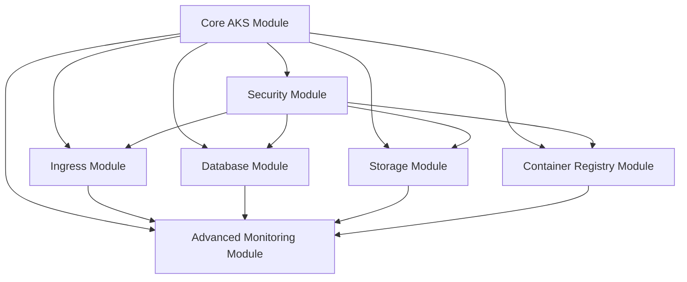

# AKS Infrastructure Modularization and Optional Components Plan

## Overview

This document outlines a comprehensive plan for refactoring the current monolithic AKS Terraform configuration into a modular, flexible architecture with optional components. The goal is to improve reusability, reduce complexity, and allow users to deploy only the components they need.

## Current Architecture Analysis

### Existing Components
The current infrastructure includes the following components in a single Terraform configuration:

1. **Base Infrastructure** (`base-infrastructure.tf`)
   - Resource Group
   - Virtual Network and Subnets
   - Network Security Groups
   - Route Tables

2. **AKS Cluster** (`aks-cluster.tf`)
   - Kubernetes cluster with CNI Overlay
   - Cilium eBPF data plane
   - Workload Identity integration
   - Container Registry (conditionally enabled)

3. **Security Layer** (`security-layer.tf`)
   - Azure Firewall with egress control
   - Key Vault with private endpoint
   - Storage Account with private endpoint
   - SQL Server with private endpoint
   - Private DNS zones

4. **Ingress Layer** (`ingress-layer.tf`)
   - Application Gateway with WAF
   - NGINX Ingress Controller deployment
   - Backend configuration

5. **Monitoring** (`monitoring.tf`)
   - Log Analytics Workspace
   - Application Insights
   - Diagnostic settings
   - Alerts and saved queries

6. **SSL/Certificates** (`ssl-cert.tf`)
   - Certificate management
   - Key Vault integration

### Current Optional Components
- Azure Container Registry (`enable_container_registry` flag)
- Secret rotation (`enable_secret_rotation` flag)

## Proposed Modularization Strategy

### 1. Core Module Structure

#### A. Core AKS Module (Required)
**Purpose**: Essential AKS cluster with basic networking
**Components**:
- Resource Group
- Virtual Network with AKS subnet
- Basic Network Security Group
- AKS cluster with CNI Overlay and Cilium
- Workload Identity setup
- Basic monitoring (Log Analytics)

**Why Core**: These components are essential for any AKS deployment and have tight interdependencies.

#### B. Security Module (Optional)
**Purpose**: Enhanced security with egress control and private endpoints
**Components**:
- Azure Firewall with custom rules
- Route tables for egress control
- Key Vault with private endpoint
- Private DNS zones
- Network security hardening

**Optional Because**: 
- Some deployments may use different egress solutions
- Development environments might not need private endpoints
- Cost considerations for smaller deployments

#### C. Ingress Module (Optional)
**Purpose**: Public traffic ingress with WAF protection
**Components**:
- Application Gateway with WAF
- Public IP management
- NGINX Ingress Controller
- SSL certificate management
- Backend health probes

**Optional Because**:
- Some deployments may use different ingress solutions (Istio, Contour)
- Internal-only applications might not need public ingress
- Cost optimization for development environments

#### D. Database Module (Optional)
**Purpose**: Managed database services with private connectivity
**Components**:
- Azure SQL Server
- SQL Database
- Private endpoint for SQL
- Database-specific DNS zones
- Database monitoring

**Optional Because**:
- Not all applications require SQL databases
- Some may use different database solutions (CosmosDB, PostgreSQL)
- Microservices might use external database services

#### E. Storage Module (Optional)
**Purpose**: Persistent storage with private connectivity
**Components**:
- Storage Account (Blob, File, Queue)
- Private endpoints for storage
- Storage-specific DNS zones
- Storage monitoring

**Optional Because**:
- Some applications are stateless
- Different storage solutions might be preferred
- Cost optimization for development

#### F. Container Registry Module (Optional)
**Purpose**: Private container image storage
**Components**:
- Azure Container Registry
- Private endpoint for ACR
- ACR-specific DNS zones
- Registry monitoring

**Optional Because**:
- Some deployments use external registries (Docker Hub, GitHub)
- Public registries might be sufficient for development
- Multi-cloud scenarios might use different registries

#### G. Advanced Monitoring Module (Optional)
**Purpose**: Comprehensive monitoring and alerting
**Components**:
- Application Insights
- Advanced Log Analytics queries
- Custom dashboards
- Alerting rules
- Performance monitoring

**Optional Because**:
- Basic monitoring is included in core
- Some organizations use external monitoring solutions
- Cost considerations for development environments

### 2. Module Dependency Map



**Dependency Rules**:
- Core AKS Module is always required
- Security Module should be enabled before other optional modules that need private endpoints
- Advanced Monitoring Module can integrate with any enabled modules

## Implementation Approach

### Phase 1: Feature Flag Implementation
Before modularization, implement feature flags for optional components:

```hcl
# Feature flags for optional components
variable "enable_azure_firewall" {
  description = "Enable Azure Firewall for egress control"
  type        = bool
  default     = true
}

variable "enable_application_gateway" {
  description = "Enable Application Gateway with WAF"
  type        = bool
  default     = true
}

variable "enable_sql_server" {
  description = "Enable Azure SQL Server"
  type        = bool
  default     = true
}

variable "enable_storage_account" {
  description = "Enable Azure Storage Account"
  type        = bool
  default     = true
}

variable "enable_private_endpoints" {
  description = "Enable private endpoints for Azure services"
  type        = bool
  default     = true
}

variable "enable_advanced_monitoring" {
  description = "Enable Application Insights and advanced monitoring"
  type        = bool
  default     = true
}
```

### Phase 2: Conditional Resource Creation
Modify existing resources to be conditional based on feature flags:

```hcl
# Example: Conditional Azure Firewall
resource "azurerm_firewall" "main" {
  count               = var.enable_azure_firewall ? 1 : 0
  name                = local.firewall_name
  location            = azurerm_resource_group.main.location
  resource_group_name = azurerm_resource_group.main.name
  # ... rest of configuration
}

# Example: Conditional route table for firewall
resource "azurerm_route_table" "aks" {
  count               = var.enable_azure_firewall ? 1 : 0
  name                = local.route_table_name
  # ... configuration with firewall dependency
}
```

### Phase 3: Module Extraction
Extract components into separate Terraform modules:

```
modules/
├── aks-core/
│   ├── main.tf
│   ├── variables.tf
│   ├── outputs.tf
│   └── README.md
├── aks-security/
│   ├── main.tf
│   ├── variables.tf
│   ├── outputs.tf
│   └── README.md
├── aks-ingress/
│   ├── main.tf
│   ├── variables.tf
│   ├── outputs.tf
│   └── README.md
├── aks-database/
│   ├── main.tf
│   ├── variables.tf
│   ├── outputs.tf
│   └── README.md
├── aks-storage/
│   ├── main.tf
│   ├── variables.tf
│   ├── outputs.tf
│   └── README.md
└── aks-monitoring/
    ├── main.tf
    ├── variables.tf
    ├── outputs.tf
    └── README.md
```

### Phase 4: Root Module Composition
Create a root module that composes the sub-modules:

```hcl
# Root main.tf
module "aks_core" {
  source = "./modules/aks-core"
  
  project      = var.project
  environment  = var.environment
  location     = var.location
  # ... other core variables
}

module "aks_security" {
  count  = var.enable_security_layer ? 1 : 0
  source = "./modules/aks-security"
  
  resource_group_name = module.aks_core.resource_group_name
  virtual_network_id  = module.aks_core.virtual_network_id
  # ... other security variables
}

module "aks_ingress" {
  count  = var.enable_application_gateway ? 1 : 0
  source = "./modules/aks-ingress"
  
  resource_group_name = module.aks_core.resource_group_name
  virtual_network_id  = module.aks_core.virtual_network_id
  aks_cluster_name    = module.aks_core.aks_cluster_name
  # ... other ingress variables
}
```

## Configuration Examples

### Minimal Development Setup
```hcl
# terraform.tfvars for development
enable_azure_firewall      = false
enable_private_endpoints    = false
enable_sql_server          = false
enable_storage_account      = false
enable_advanced_monitoring  = false
enable_container_registry   = false

# Use basic ingress without WAF
enable_application_gateway  = false
```

### Production Setup
```hcl
# terraform.tfvars for production
enable_azure_firewall      = true
enable_private_endpoints    = true
enable_sql_server          = true
enable_storage_account      = true
enable_advanced_monitoring  = true
enable_container_registry   = true
enable_application_gateway  = true
```

### Microservices Setup (No Database)
```hcl
# terraform.tfvars for microservices
enable_azure_firewall      = true
enable_private_endpoints    = true
enable_sql_server          = false  # Using external databases
enable_storage_account      = true
enable_advanced_monitoring  = true
enable_container_registry   = true
enable_application_gateway  = true
```

## Benefits of Modularization

### 1. Flexibility
- **Choose Components**: Deploy only needed components
- **Cost Optimization**: Reduce costs by excluding unnecessary resources
- **Environment Specific**: Different configurations for dev/test/prod

### 2. Reusability
- **Module Sharing**: Modules can be shared across projects
- **Versioning**: Independent versioning of modules
- **Testing**: Easier to test individual components

### 3. Maintainability
- **Separation of Concerns**: Each module has a specific purpose
- **Easier Updates**: Update individual modules without affecting others
- **Reduced Complexity**: Smaller, focused configurations

### 4. Team Collaboration
- **Ownership**: Different teams can own different modules
- **Parallel Development**: Teams can work on modules independently
- **Expertise**: Specialized teams for security, networking, etc.

## Migration Strategy

### Step 1: Backward Compatibility
- Maintain current monolithic structure as default
- Add feature flags with current behavior as default
- Ensure existing deployments continue to work

### Step 2: Gradual Adoption
- Allow users to opt-in to modular approach
- Provide migration guides
- Support both approaches during transition

### Step 3: Full Migration
- Move to modular approach as default
- Deprecate monolithic structure
- Provide migration tooling

## Risk Considerations

### 1. Complexity Increase
- **Risk**: More configuration files and dependencies
- **Mitigation**: Clear documentation and examples

### 2. Breaking Changes
- **Risk**: Module updates might break existing deployments
- **Mitigation**: Semantic versioning and upgrade guides

### 3. State Management
- **Risk**: Complex Terraform state with multiple modules
- **Mitigation**: Use remote state and proper state organization

### 4. Dependency Management
- **Risk**: Complex inter-module dependencies
- **Mitigation**: Clear dependency documentation and validation

## Testing Strategy

### 1. Module Testing
- Unit tests for individual modules
- Integration tests for module combinations
- Automated testing in CI/CD pipelines

### 2. Configuration Testing
- Test different feature flag combinations
- Validate dependencies between modules
- Performance testing for different configurations

### 3. Migration Testing
- Test migration from monolithic to modular
- Validate backward compatibility
- Test rollback procedures

## Documentation Requirements

### 1. Module Documentation
- README for each module
- Variable descriptions and examples
- Output descriptions
- Usage examples

### 2. Architecture Documentation
- Updated architecture diagrams
- Dependency diagrams
- Configuration examples

### 3. Migration Documentation
- Step-by-step migration guide
- Troubleshooting guide
- FAQ for common issues

## Timeline and Milestones

### Month 1: Planning and Design
- [ ] Finalize module structure
- [ ] Define interfaces between modules
- [ ] Create detailed implementation plan

### Month 2: Core Implementation
- [ ] Implement feature flags in current structure
- [ ] Add conditional resource creation
- [ ] Test with different flag combinations

### Month 3: Module Creation
- [ ] Extract core AKS module
- [ ] Extract security module
- [ ] Extract ingress module

### Month 4: Additional Modules
- [ ] Extract database module
- [ ] Extract storage module
- [ ] Extract monitoring module

### Month 5: Integration and Testing
- [ ] Create root module composition
- [ ] Comprehensive testing
- [ ] Documentation updates

### Month 6: Migration and Rollout
- [ ] Migration tooling
- [ ] User migration guide
- [ ] Gradual rollout to users

## Conclusion

This modularization plan provides a path from the current monolithic Terraform configuration to a flexible, modular architecture. The approach prioritizes backward compatibility while enabling users to choose only the components they need. The phased implementation ensures minimal disruption while providing maximum flexibility for different use cases and environments.

The key success factors are:
1. Maintaining backward compatibility during transition
2. Clear documentation and examples
3. Comprehensive testing of all configurations
4. Gradual migration with user support
5. Proper versioning and dependency management

This plan will result in a more maintainable, flexible, and cost-effective AKS infrastructure solution that can adapt to various organizational needs and deployment scenarios.