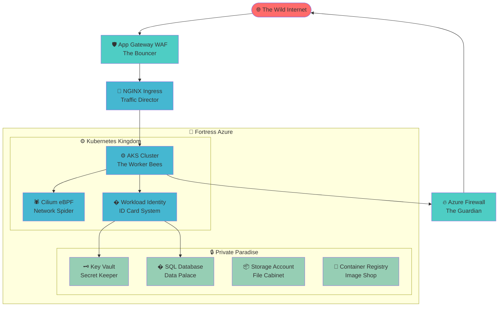

# 🚀 AKS Terraform Magic ✨

> **Because deploying Kubernetes should be as easy as ordering pizza! 🍕**

   

## 🎪 What's This Circus About?

Welcome to the **most over-engineered, security-obsessed, auto-everything AKS cluster** you've ever seen! 🎭

We took Microsoft's boring "Secure Baseline" and made it:
- 🤖 **100% Auto-generated** - No more "password123" embarrassment!
- 🛡️ **Fort Knox Secure** - Hackers will cry tears of frustration
- 🚫 **Zero Hardcoded Anything** - Your secrets stay secret!
- 🎯 **One-Click Deploy** - `terraform apply` and grab a coffee ☕

## 🏗️ The Beautiful Architecture



## 🎯 Features That'll Make You Famous

### 🛡️ **Security Theater (But Actually Secure!)**
- ✅ Only ONE public IP (App Gateway is the chosen one)
- ✅ Everything else hiding behind private endpoints
- ✅ WAF protection (goodbye script kiddies! 👋)
- ✅ Zero Trust networking (trust nobody, not even yourself!)

### 🤖 **Auto-Everything Magic**
- ✅ Passwords? We generate those! 🎲
- ✅ Certificates? Auto-created! 📜
- ✅ User permissions? Detected automatically! 🕵️
- ✅ Dependencies? We know what we're doing! 🧠

### 🚀 **Modern Kubernetes Superpowers**
- ✅ CNI Overlay + Cilium eBPF (faster than your morning coffee)
- ✅ Workload Identity (no more secret juggling!)
- ✅ Auto-scaling (grows like your cloud bill! 💸)
- ✅ Private everything (more private than your diary)

## 🚀 Quick Start (AKA "The Magic Spell")

### 📋 Prerequisites
```bash
# You need these magical tools:
# ✅ Azure CLI (your cloud wand)
# ✅ Terraform >= 1.0 (the infrastructure wizard)
# ✅ kubectl (your k8s remote control)
# ✅ An Azure subscription (and a credit card 💳)
```

### 🪄 The Deployment Ritual

```bash
# 1. Enter the sacred directory
cd infra

# 2. Copy the ancient scrolls
cp terraform.tfvars.example terraform.tfvars
# Edit with your mystical values (but no passwords needed!)

# 3. Summon the infrastructure spirits
terraform init
terraform plan    # Peek into the future
terraform apply   # Make it rain resources! ☔

# 4. Connect to your new kingdom
az aks get-credentials \
  --resource-group $(terraform output -raw resource_group_name) \
  --name $(terraform output -raw aks_cluster_name)

# 5. Witness the magic
kubectl get nodes  # Your loyal servants
```

## �️ Project Structure (The Neat Freak's Dream)

```
├── 🏗️ infra/                    # Where the magic happens
│   ├── 🔧 terraform.tf          # Provider wizardry
│   ├── 📝 variables.tf          # The wish list
│   ├── 🏠 base-infrastructure.tf # Foundation stones
│   ├── 🔐 security-layer.tf     # The fortress walls
│   ├── ⚙️ aks-cluster.tf        # The beating heart
│   ├── 🌐 ingress-layer.tf      # Traffic control center
│   ├── 🔑 secrets.tf            # Auto-magic password factory
│   ├── 👤 sql-identities.tf     # Identity management circus
│   └── 📊 monitoring.tf         # The all-seeing eye
├── 📖 DEPLOYMENT-GUIDE.md       # The instruction manual
└── 📋 README.md                 # This masterpiece
```

## ⚙️ Configuration (The Easy Part!)

Just create `infra/terraform.tfvars` with:

```hcl
# That's it! Everything else is auto-generated! 🎉
environment = "prod"      # or "dev", "test", whatever!
project     = "myapp"     # your app's name
location    = "East US"   # pick your favorite region
```

**No passwords! No object IDs! No tears! 😭➡️😄**

## 🎭 What Makes This Special?

### 🤖 **Zero Manual Labor**
- Passwords? Generated with cryptographic randomness! 🎲
- User permissions? Auto-detected from your Azure login! 🕵️
- SSL certificates? Created and managed automatically! 📜
- Dependencies? Implicit and beautiful! 💅

### 🔐 **Security That Actually Works**
- Every Azure service gets a private endpoint 🏠
- Network traffic flows through firewalls and WAFs 🛡️
- Workload Identity eliminates secret sprawl 🔑
- Zero Trust networking (because trust issues are valid!) 💔

### 📊 **Monitoring Like a Boss**
- Logs everything that moves 📝
- Alerts when things go sideways 🚨
- Dashboards prettier than your Instagram 📸
- Cost tracking (so you don't get surprised! 💸)

## 🎪 Advanced Party Tricks

### 🔄 **GitOps Integration**
```bash
# Because manual deployments are so 2020
flux bootstrap github --owner=you --repository=your-repo
```

### 🕸️ **Service Mesh (If You're Feeling Fancy)**
```bash
# Turn your cluster into a spider web of awesomeness
istioctl install --set values.defaultRevision=default
```

### 👮 **Policy Police**
```bash
# Keep your developers in line
kubectl apply -f https://raw.githubusercontent.com/open-policy-agent/gatekeeper/release-3.14/deploy/gatekeeper.yaml
```

## � Cost Optimization (Your CFO's Favorite Section)

- 🎛️ **Auto-scaling**: Scales up when busy, down when lazy
- 💰 **Spot instances**: For the budget-conscious
- ⏰ **Scheduling**: Turn off dev environments at night
- 📊 **Cost alerts**: Before your credit card melts

## 🆘 Troubleshooting (When Things Go Boom)

```bash
# The universal kubernetes debugging commands
kubectl get pods --all-namespaces  # What's running?
kubectl describe node              # Node having issues?
kubectl logs -f deployment/app     # What went wrong?

# Azure-specific debugging
az aks show --resource-group rg --name cluster  # Cluster healthy?
```

## 🤝 Contributing (Join the Fun!)

1. 🍴 Fork this repo
2. 🌿 Create a branch (`git checkout -b my-awesome-feature`)
3. ✨ Make it better
4. 🚀 Submit a PR
5. 🎉 Become internet famous!

## 📚 Learn More (Feed Your Brain)

- [🏗️ AKS Secure Baseline](https://docs.microsoft.com/en-us/azure/architecture/reference-architectures/containers/aks/secure-baseline-aks)
- [🕷️ Cilium Docs](https://cilium.io/)
- [🔑 Workload Identity](https://docs.microsoft.com/en-us/azure/aks/workload-identity-overview)
- [🌐 CNI Overlay](https://docs.microsoft.com/en-us/azure/aks/concepts-network#azure-cni-overlay-networking)

## ⚠️ Fine Print

This is a reference implementation. Please don't blame us if you accidentally deploy 1000 nodes and get a bill that requires a second mortgage. Test responsibly! 🏠💸

---

**🎉 Ready to rule the cloud? Deploy now and become the hero your team deserves! 🦸‍♀️**

*Built with ❤️, ☕, and an unhealthy amount of automation*